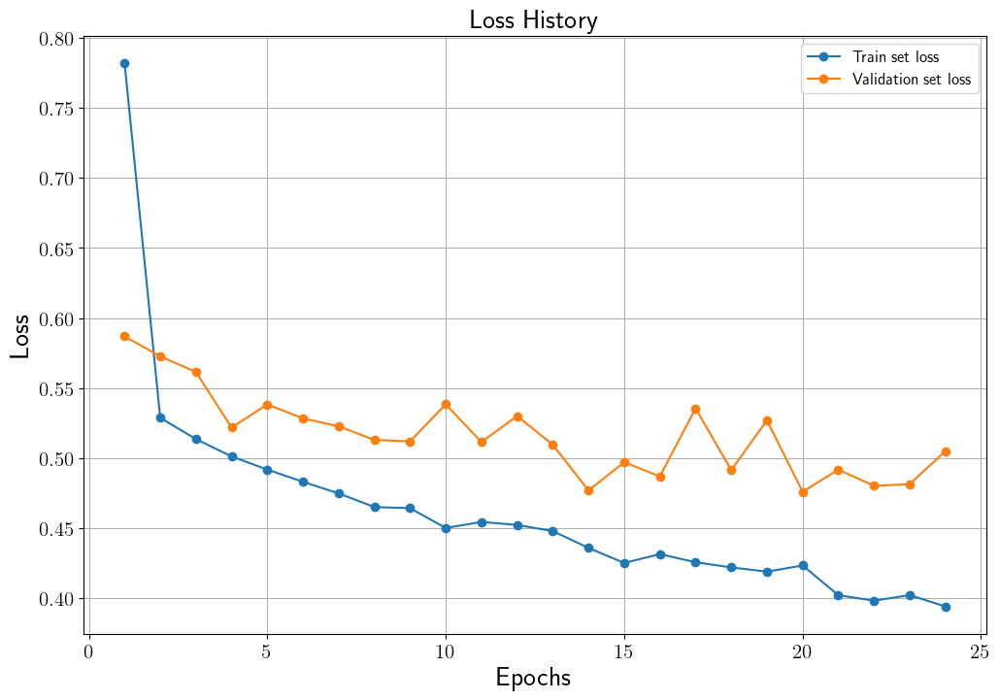

# Graph Classification using Graph Convolutional Networks
한국어 버전의 설명은 [여기](./docs/README_ko.md)를 참고하시기 바랍니다.

## Introduction
Graph classification is one of the tasks that can be solved using Graph Neural Networks (GNNs).
This code performs a graph classification task using the COLLAB graph data from the [TUDataset](https://chrsmrrs.github.io/datasets/).
In the COLLAB graph, nodes represent researchers, and edges indicate collaborations between them. Each graph represents a collaboration network of researchers, and the field to which the researchers in a graph belong is assigned as the label of that graph.
The labels are of three types: High Energy Physics, Condensed Matter Physics, and Astro Physics. Additionally, the distribution of the learned graph features is visualized using t-SNE.
For a detailed explanation of this code, please refer to [GCN을 이용한 COLLAB TUDataset 그래프 분류](https://ljm565.github.io/contents/gnn3.html).

<br><br><br>

## Supported Models
### Graph Convolutional Networks (GCN)
* A GCN is implemented with the PyTorch Geometric library.
<br><br><br>

## Base Dataset
* COLLAB dataset among the [TUDataset](https://chrsmrrs.github.io/datasets/).
* Custom datasets can also be used by setting the path in the `config/config.yaml`.
However, implementing a custom dataloader may require additional coding work in `src/trainer/build.py`.
<br><br><br>

## Supported Devices
* CPU, GPU (DDP is not supported), MPS (for Mac and torch>=1.13.0)
<br><br><br>

## Quick Start
```bash
python3 src/run/train.py --config config/config.yaml --mode train
```
<br><br>

## Project Tree
This repository is structured as follows.
```
├── configs                         <- Folder for storing config files
│   └── *.yaml
│
└── src      
    ├── models
    |   └── gcn.py                  <- GCN model file
    |
    ├── run                   
    |   ├── train.py                <- Training execution file
    |   ├── validation.py           <- Trained model evaulation execution file
    |   └── vis_tsne.py             <- Trained model t-SNE visualization execuation file
    | 
    ├── tools                   
    |   ├── model_manager.py          
    |   └── training_logger.py      <- Training logger class file
    |
    ├── trainer                 
    |   ├── build.py                <- Codes for initializing dataset, etc.
    |   └── trainer.py              <- Class for training, evaluating, and visualizing with t-SNE
    |
    └── uitls                   
        ├── __init__.py             <- File for initializing the logger, versioning, etc.
        ├── data_utils.py           <- File for pre-preprocessing graph data
        ├── filesys_utils.py       
        └── training_utils.py     
```
<br><br>

## Tutorials & Documentations
Please follow the steps below to train the GCN.

1. [Getting Started](./docs/1_getting_started.md)
2. [Data Preparation](./docs/2_data_preparation.md)
3. [Training](./docs/3_training.md)
4. ETC
   * [Evaluation](./docs/4_model_evaluation.md)
   * [Predicted Feature Visualization using t-SNE](./docs/5_tsne_vis.md)

<br><br><br>

## Training Results
### Graph Classification Trained Results
* Loss History<br>
<br><br>

* Accuracy History<br>
<br><br>


* Test set accuracy: 0.7907 (14 epoch)<br>
(The test set results of the model when the highest accuracy on the validation set is achieved.)<br><br>

* Test set Feature Distribution<br>
<br><br>

<br><br>


## ETC
This code uses the PyTorch-Geometric library for batch training, unlike the naive implementation of [Paper Category Classification using Graph Convolutional Networks](https://github.com/ljm565/paper-category-prediction-GCN).
<br><br><br>
