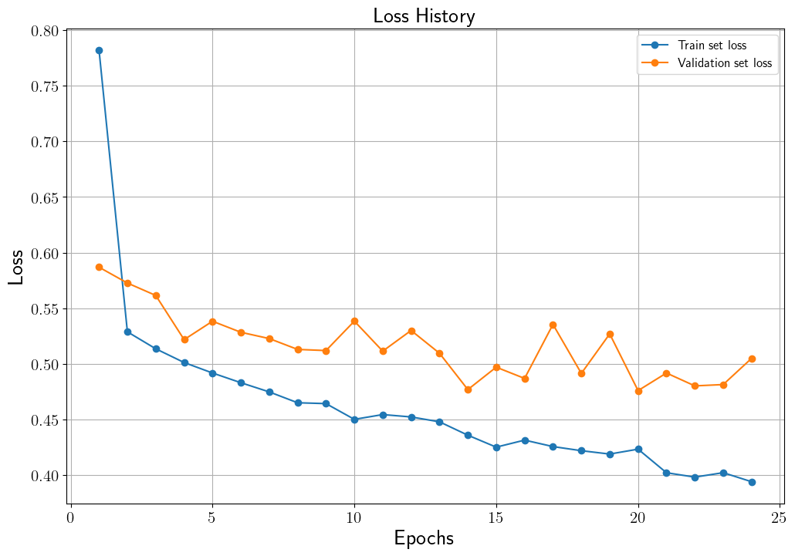
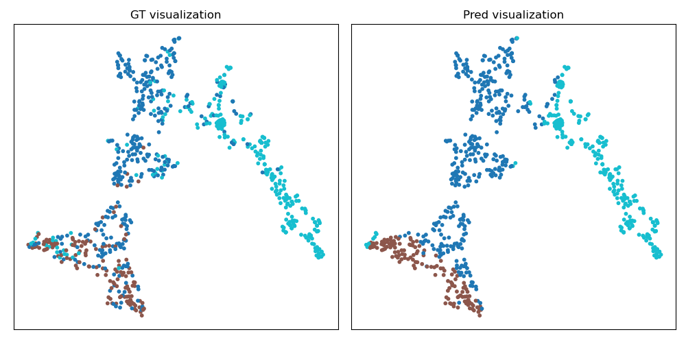

# Graph Classification using Graph Convolutional Networks

## Introduction
Graph classification은 Graph Neural Networks (GNN)을 활용하여 풀 수 있는 task 중 하나입니다.
본 코드는 [TUDataset](https://chrsmrrs.github.io/datasets/)의 여러 데이터 중 COLLAB 그래프 데이터를 이용하여 그래프 분류 task를 수행합니다.
COLLAB 그래프는 연구자들이 node로 나타나며, 서로 협업을 했던 경험이 있는 경우 edge로 연결 되어있습니다.
즉 하나의 그래프는 여러 연구자들로 이루어진 협업 상태를 나타내며, 하나의 그래프를 이루고 있는 연구자들이 속한 필드가 그 그래프의 label로 지정되어있습니다.
Label은 High Energy Physics, Condensed Matter Physics, Astro Physics의 3가지 종류가 있습니다.
뿐만 아니라 학습된 그래프 feature의 분포를 t-SNE를 통해 가시화합니다.
본 코드의 자세한 설명은 [GCN을 이용한 COLLAB TUDataset 그래프 분류](https://ljm565.github.io/contents/gnn3.html)을 참고하시기 바랍니다.
<br><br><br>

## Supported Models
### Graph Convolutional Networks (GCN)
* PyTorch Geometric 라이브러리를 이용한 GCN이 구현되어있습니다.
<br><br><br>


## Base Dataset
* [TUDataset](https://chrsmrrs.github.io/datasets/)의 COLLAB 데이터.
* Custom 데이터는 `config/config.yaml`에 데이터 경로를 입력해야합니다. 그리고 `src/trainer/build.py`에 custom data를 처리하는 코드를 구현해야합니다.
<br><br><br>

## Supported Devices
* CPU, GPU (DDP is not supported), MPS (for Mac and torch>=1.13.0)
<br><br><br>

## Quick Start
```bash
python3 src/run/train.py --config config/config.yaml --mode train
```
<br><br>

## Project Tree
본 레포지토리는 아래와 같은 구조로 구성됩니다.
```
├── configs                         <- Config 파일들을 저장하는 폴더
│   └── *.yaml
│
└── src      
    ├── models
    |   └── gcn.py                  <- GCN 모델 파일
    |
    ├── run                   
    |   ├── train.py                <- 학습 실행 파일
    |   ├── validation.py           <- 학습된 모델 평가 실행 파일
    |   └── vis_tsne.py             <- 학습된 모델 t-SNE 가시화 실행 파일
    | 
    ├── tools                   
    |   ├── model_manager.py          
    |   └── training_logger.py      <- Training logger class 파일
    |
    ├── trainer                 
    |   ├── build.py                <- Dataset, dataloader 등을 정의하는 파일
    |   └── trainer.py              <- 학습, 평가 등을 수행하는 class 파일
    |
    └── uitls                   
        ├── __init__.py             <- Logger, 버전 등을 초기화 하는 파일
        ├── data_utils.py           <- 그래프 데이터 전처리 파일
        ├── filesys_utils.py       
        └── training_utils.py     
```
<br><br>

## Tutorials & Documentations
GCN 모델을 학습하기 위해서 다음 과정을 따라주시기 바랍니다.

1. [Getting Started](./1_getting_started_ko.md)
2. [Data Preparation](./2_data_preparation_ko.md)
3. [Training](./3_training_ko.md)
4. ETC
   * [Evaluation](./4_model_evaluation_ko.md)
   * [Predicted Feature Visualization using t-SNE](./5_tsne_vis_ko.md)

<br><br><br>


## Training Results
### Graph Classification Trained Results
* Loss History<br>
<br><br>

* Accuracy History<br>
<br><br>


* Test set accuracy: 0.7907 (14 epoch)<br>
(Validation set의 가장 높은 accuracy를 달성했을 때 모델의 test set 결과)<br><br>

* 학습된 Test set Feature Distribution<br>
<br><br>


## 기타
본 코드는 naive하게 구성한 [Paper Category Classification using Graph Convolutional Networks](https://github.com/ljm565/paper-category-prediction-GCN) 코드와 다르게 pytorch-geometric library를 사용하여 batch 학습을 하는 코드입니다.
<br><br><br>
